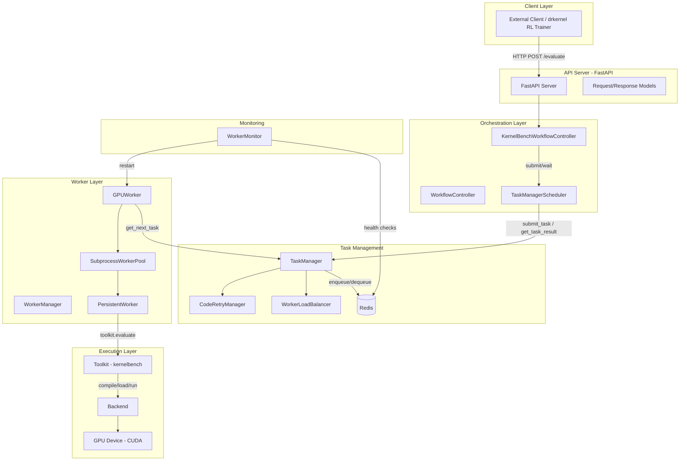
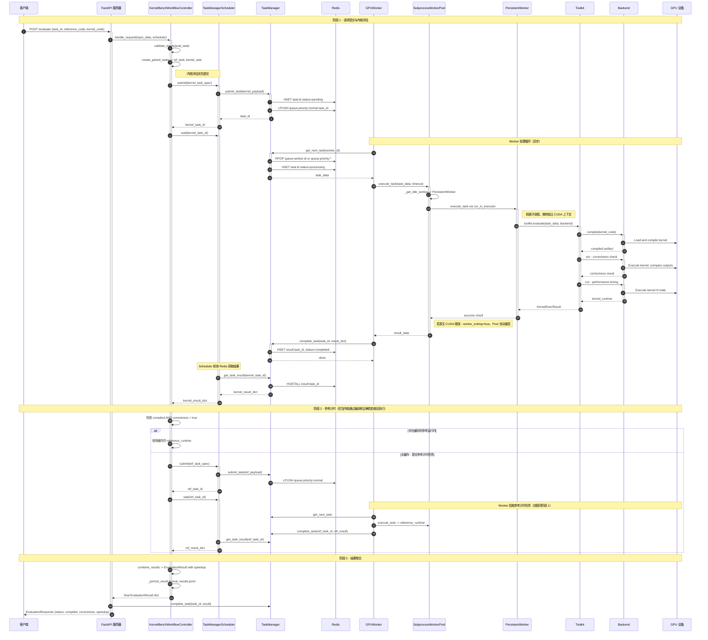
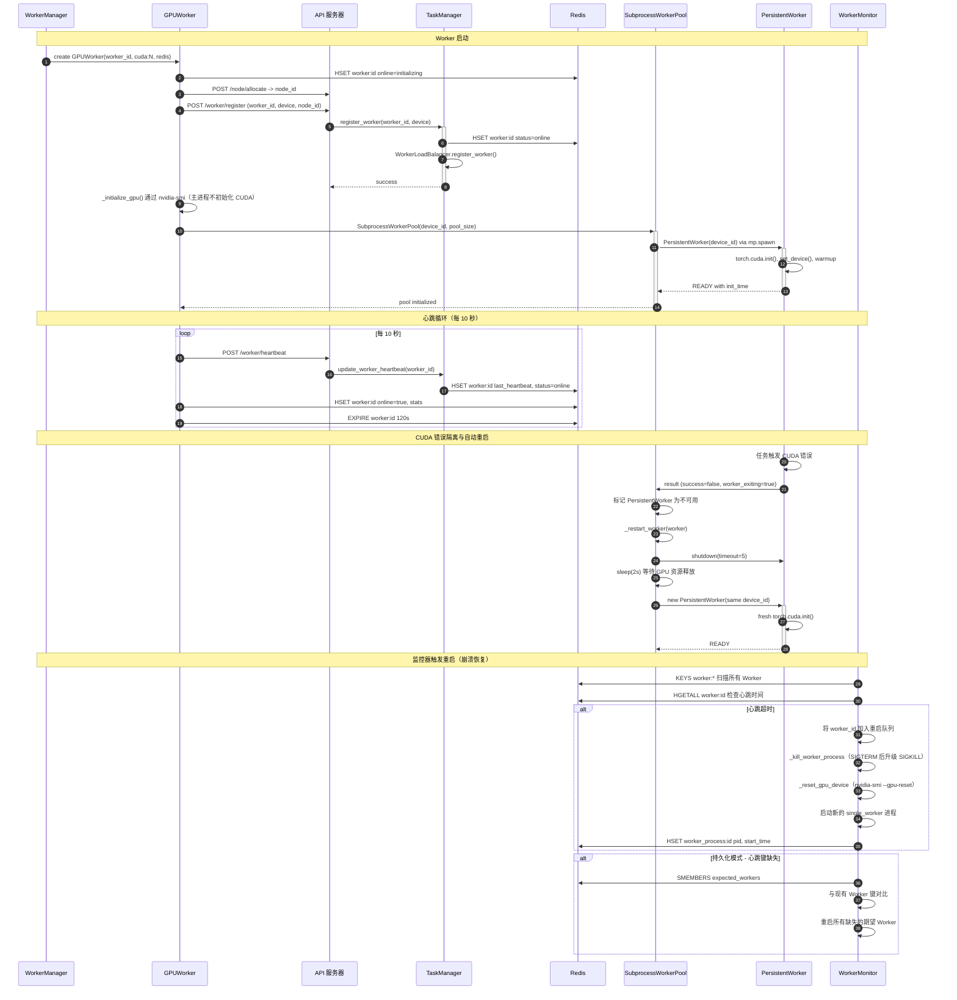
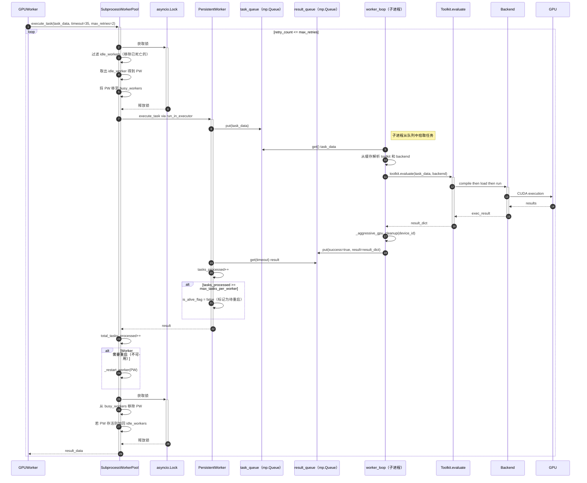
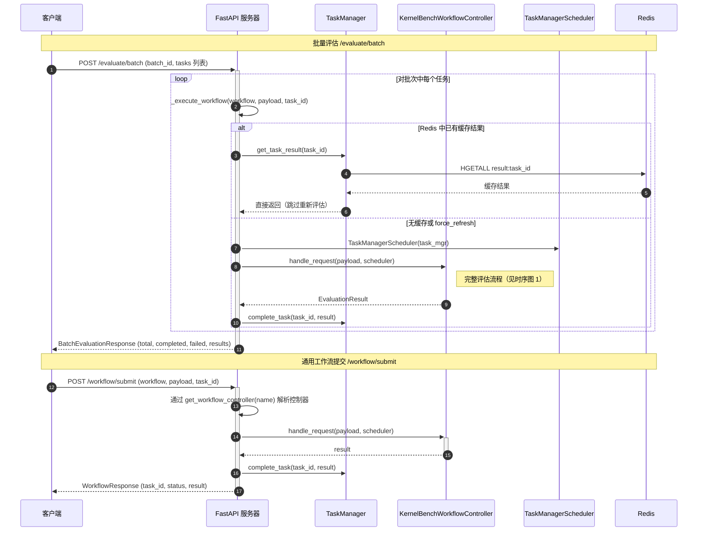
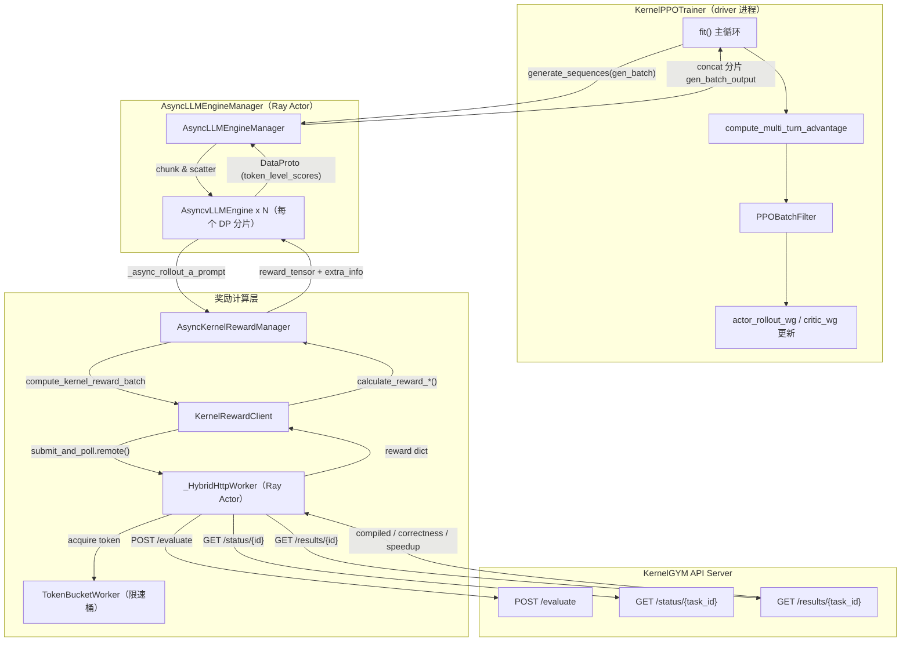
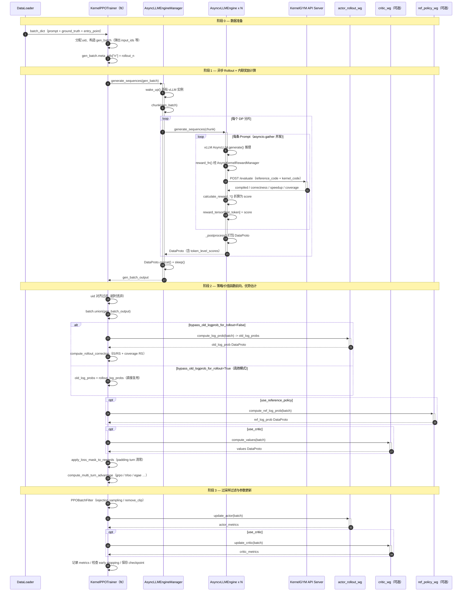
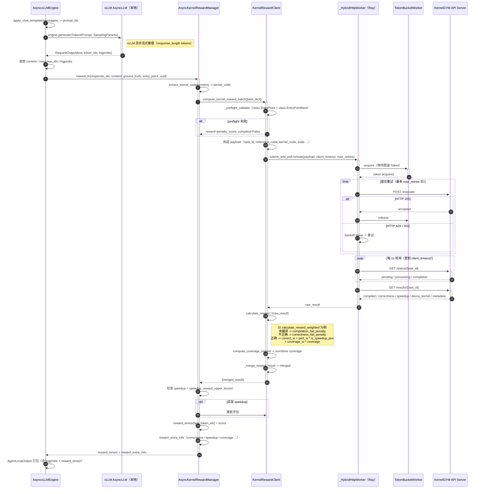
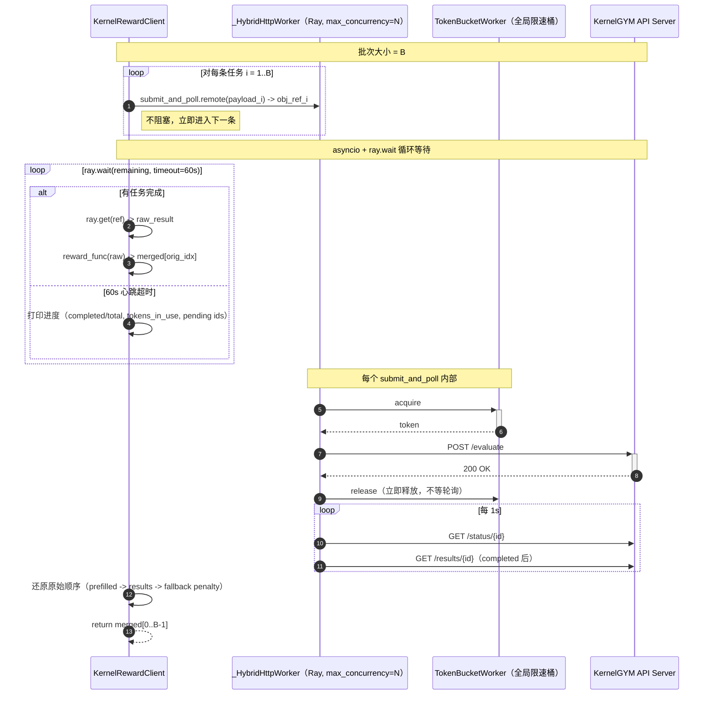

# KernelGYM 框架架构

## 概述

KernelGYM 是一个用于基准测试 CUDA/Triton 内核的分布式 GPU 内核评估服务。它提供基于 FastAPI 的服务器，接受评估请求、编排多阶段工作流（内核编译、正确性检查、性能计时），通过 Redis 支持的任务队列将工作分配给 GPU Worker，并在 CUDA 隔离的子进程池中执行任务。伴生 RL 训练层（`drkernel`）使用评估奖励通过 PPO 训练内核生成策略。

---

## 组件结构



---

## 时序图 1：端到端内核评估（关键路径）

**主要关键路径**：客户端提交内核进行评估，服务器编排两阶段工作流（内核评估 + 参考计时），结果最终返回给客户端。



---

## 时序图 2：Worker 生命周期与健康监控

Worker 注册、心跳循环、CUDA 错误隔离，以及监控器触发的自动重启流程。



---

## 时序图 3：子进程池内部流程

[SubprocessWorkerPool](file:///home/robomaster/Research/KernelGYM/kernelgym/worker/subprocess_pool.py#298-627) 与 [PersistentWorker](file:///home/robomaster/Research/KernelGYM/kernelgym/worker/subprocess_pool.py#100-296) 的内部流程，包括通过多进程队列进行的进程间通信（IPC）。



---

## 时序图 4：批量评估与工作流提交

备用 API 入口：批量评估和通用工作流提交，支持 Redis 结果缓存。



---

## 关键架构决策

| 决策 | 设计依据 |
|------|----------|
| **子进程 CUDA 隔离**（spawn 模式） | 主 GPUWorker 进程永不初始化 CUDA。所有 GPU 工作在 [PersistentWorker](file:///home/robomaster/Research/KernelGYM/kernelgym/worker/subprocess_pool.py#100-296) 子进程中执行。CUDA 错误仅终止子进程，主 Worker 自动重启新子进程。 |
| **持久化 Worker 池** vs 每任务 spawn | 通过复用已初始化的子进程，消除每任务约 2.5s 的启动开销。Worker 在处理 `max_tasks_per_worker` 任务后自动回收以防止显存累积。 |
| **Redis 作为中央状态存储** | 任务队列、Worker 注册表、心跳、结果均存储于 Redis，使 API 服务器与 GPU Worker 跨节点解耦。 |
| **两阶段工作流**（内核 → 参考计时） | 仅当内核通过编译+正确性检查后才提交参考计时任务，节省失败内核的 GPU 时间。参考计时结果可缓存复用。 |
| **WorkerMonitor** 作为独立进程 | 独立运行，周期性扫描 Redis 检测崩溃/死亡 Worker 并重启。支持持久化模式，通过期望 Worker 集合管理集群部署。 |
| **优先级队列**（high/normal/low） | TaskManager 支持基于优先级的调度及每 Worker 专属队列以实现亲和性路由。 |

---

## 数据流概览

```
客户端请求
    |
    v
FastAPI /evaluate --> KernelBenchWorkflowController
    |                        |
    |                  +-----+-----+
    |                  | 阶段 1    | 阶段 2
    |                  v           v
    |          内核评估 Eval   参考计时 Ref
    |          TaskSpec         TaskSpec
    |              |              |
    |              v              v
    |     TaskManagerScheduler.submit()
    |              |
    |              v
    |     TaskManager --> Redis 任务队列
    |              |
    |          +---+
    |          v
    |     GPUWorker.get_next_task()
    |          |
    |          v
    |     SubprocessWorkerPool
    |          |
    |          v
    |     PersistentWorker（子进程）
    |          |
    |     +----+----+
    |     v         v
    |  Toolkit   Backend
    |     |         |
    |     +----+----+
    |          v
    |     GPU 执行
    |          |
    |          v
    |     结果写入 Redis
    |          |
    |          v
    |     Scheduler.wait() 轮询 Redis
    |          |
    |          v
    |     WorkflowController 聚合结果
    |          |
    |          v
    +---> EvaluationResponse --> 客户端
```

---

## verl Rollout 与 KernelGYM 的交互

### 概述

drkernel 将 KernelGYM 评估服务作为 **外部奖励源** 接入 verl PPO 训练框架。每轮训练的 Rollout 阶段，vLLM 为每条 Prompt 异步生成内核代码；生成完毕后立即调用 `AsyncKernelRewardManager`，后者通过 `KernelRewardClient` 将代码以 HTTP 请求提交给 KernelGYM API Server，轮询评估结果并折算成奖励分数，最终汇入 `token_level_scores`，供 PPO 优势估计（`compute_multi_turn_advantage`）和策略更新使用。

---

### RL 训练层组件



---

### 时序图 5：verl PPO 训练主循环（含 KernelGYM 交互）

**一个完整的 PPO Step**，从数据加载到最终参数更新。



---

### 时序图 6：单 Prompt 异步 Rollout + KernelGYM 奖励（细节）

Rollout 阶段中单条 Prompt 从 vLLM 生成到获得奖励的完整细节，对应
[AsyncvLLMEngine._async_rollout_a_prompt](file:///home/robomaster/Research/KernelGYM/drkernel/kernel/workers/rollout/vllm_rollout/vllm_async_engine.py#592-666)
与 [AsyncKernelRewardManager.__call__](file:///home/robomaster/Research/KernelGYM/drkernel/kernel/workers/reward_manager/kernel_async.py#191-339)。



---

### 时序图 7：批量奖励并发与限速控制

多路 Prompt 并发提交 KernelGYM 时，[KernelRewardClient.compute_batch_rewards](file:///home/robomaster/Research/KernelGYM/drkernel/kernel/rewards/reward_client.py#554-755) 通过 Ray 对象引用实现全并发，`TokenBucketWorker` 控制瞬时 QPS。



---

### 关键架构决策（RL 训练层）

| 决策 | 设计依据 |
|------|----------|
| **奖励内联于 Rollout**（非独立 reward_fn 阶段） | vLLM 生成完毕后立即在同一 asyncio Task 内调用 `AsyncKernelRewardManager`，将 `token_level_scores` 直接写入 `DataProto`，避免 Trainer 侧再发起一轮 RPC 拉取数据。 |
| **Ray Actor 作为 HTTP Worker 池** | `_HybridHttpWorker` 以 `max_concurrency=N` 部署为单个 Ray Actor，所有 httpx 连接复用；与 `TokenBucketWorker` 协同实现 QPS 限速。 |
| **两级超时设计**（`task_timeout` + `task_timeout_in_client`） | `task_timeout` 传入 KernelGYM 控制内核执行上限；`task_timeout_in_client` 是客户端轮询总时限，须 >= `task_timeout`，防止 Trainer 在 QPS 高峰时无限阻塞。 |
| **Preflight 校验** | 提交前检查 `class EntryPoint` / `class EntryPointNew` 是否存在，无效代码直接返回 penalty，节省 KernelGYM GPU 资源。 |
| **异常 Speedup 重评** | 若 `speedup > speedup_reward_upper_bound`，自动重评一次，防止 GPU 计时噪声污染训练信号。 |
| **`bypass_old_logprob_for_rollout`** | 启用后用 `rollout_log_probs` 直接替代 `old_log_probs`，跳过额外 Actor 前向，显著降低单 Step 时延。 |
| **Coverage 奖励扩展** | 从 KernelGYM profiling metadata 提取自定义 kernel 覆盖率（数量/时间），叠加到正确性/性能奖励，引导模型覆盖更多计算路径。 |
| **Coverage Rejection Sampling** | `compute_coverage_rejection_mask` 额外过滤覆盖率不达标的正确样本，防止低覆盖的"取巧"解法混入策略更新。 |

---

## RL 训练数据流概览

```
DataLoader（JSONL Prompt + ground_truth）
    |
    v
KernelPPOTrainer.fit() -- 构造 gen_batch
    |
    v
AsyncLLMEngineManager.generate_sequences()
    |   <- chunk 分片到各 DP 节点
    v
AsyncvLLMEngine._async_rollout_a_prompt() x B x n（并发）
    |
    +--[vLLM 推理]--> response_ids + logprobs
    |
    +--[内联奖励]--> AsyncKernelRewardManager
                          |
                     KernelRewardClient
                          |
                   _HybridHttpWorker（Ray）
                          |
               +----------+-----------+
               |                      |
          POST /evaluate        GET /status
          GET /results           （轮询）
               |
      KernelGYM API Server（见时序图 1）
               |
      compiled / correctness / speedup / coverage
               |
      calculate_reward_*() -> reward_score
               |
    reward_tensor[last_token] = score
    token_level_scores 写入 DataProto
    |
    v
KernelPPOTrainer -- 汇聚所有 DP 分片
    |
    v
old_log_prob / ref_log_prob / values（FSDP Worker 前向）
    |
    v
compute_multi_turn_advantage（grpo / trloo / egae …）
    |
    v
PPOBatchFilter（rejection sampling / oversampling 裁剪）
    |
    v
actor_rollout_wg.update_actor() + critic_wg.update_critic()
    |
    v
checkpoint / metrics / early stopping
```
